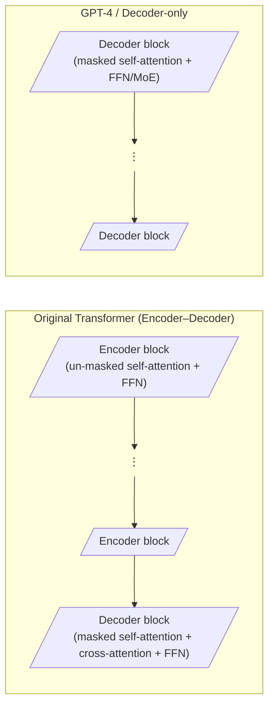

```mermaid
flowchart LR
  %% Original Transformer (Encoder–Decoder)
  subgraph ENCDEC["Original Transformer (Encoder–Decoder)"]
    direction TB
    ENC1[/"Encoder block\n(un-masked self-attention + FFN)"/]
    ENC2[/"⋮"/]:::ghost
    ENC3[/"Encoder block"/]
    style ENC2 fill:none,stroke:none
    DEC1[/"Decoder block\n(masked self-attention + cross-attention + FFN)"/]
    ENC1 --> ENC2 --> ENC3 --> DEC1
  end

  %% GPT-4 / Decoder-only
  subgraph GPT4["GPT-4 / Decoder-only"]
    direction TB
    D1[/"Decoder block\n(masked self-attention + FFN/MoE)"/]
    D2[/"⋮"/]:::ghost
    D3[/"Decoder block"/]
    style D2 fill:none,stroke:none
    D1 --> D2 --> D3
  end

  classDef ghost fill:none,stroke:none;
```
