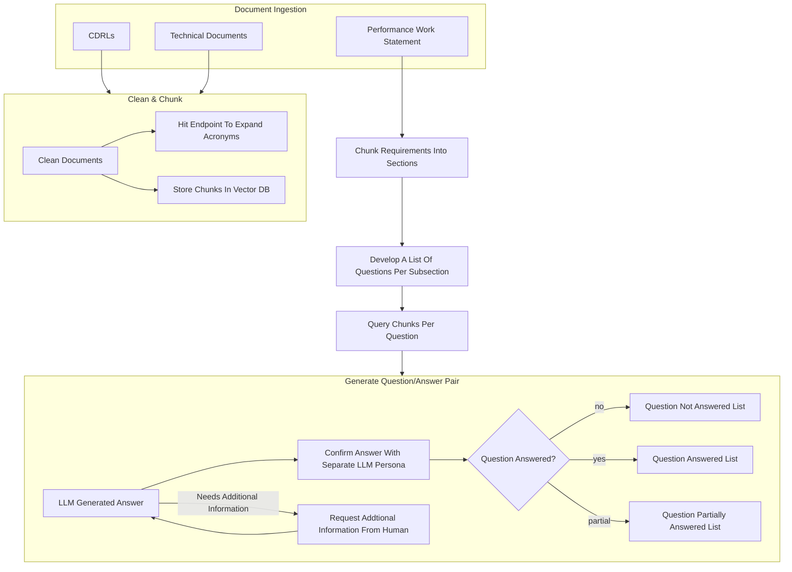

---
tags:
  - "#work"
  - "#gap-analysis"
---

# Misc. Talk 1

## Key Points

- Have an endpoint where an acronym can be sent and the expansion returned `/get`
- Chunk the *PWS* into different sections ($X.X.X$ sections)
	- Develop a list of questions per section
	- First point of human intervention would be allowing the engineers to refine/enhance the requirement descriptions before generating the questions.
	- Second point of human intervention is grooming the list of questions made by the LLM
	- 

## Questions:

- Can we export PowerPoint documents as HTML5?
- 

